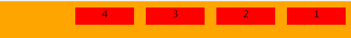

#CSS  flex布局
### flex基础概念
- display相关flex语法：display：flex 和 display:inline-flex
- flex是一维布局模式，flex只有行没有列的概念，主轴（main axis） 和交叉轴（cross axis）
- flexbox只会挤压content内容，不会对margin，padding，border造成挤压，盒子有显示申明width的情况下，文字也会造成挤压
### flex基础属性定义与使用
#### 1.flex-direction（申明主轴的方位和方向）
```
.container{
	flex-direction:row(default)|row-reverse|column|colimn-reverse
}
```


####2.flex-wrap  (属性申明一行放不下时是否需要换行)
```css
.container{
	flex-wrap:nowrap(default)|wrap|wrap-reverse
}
```
####3.justify-content （申明每行内的项目如何水平对齐，类似于text-align使用方式一样）
```css
.container{
	justify-content:flex-start(default)|flex-end|center|spance-between|space-around|space-evenly;
}
```


```.container{
		width: 600px;
		height: 200px;
		background-color: orange;
		display: flex;
		justify-content:space-between
	}
```
####4.align-items (属性申明每行内的项目如何垂直对齐,可用于做垂直居中)

```css
.container{
	align-items:stretch(default)|flex-start|flex-end|center|baseline;
}
```


```.container{
	align-items:center;
}
```
####5.order （属性申明的是弹性项目自身的展示顺序）
```css
.child{
order:-1;//default is 0 
}

```
####6.flex-grow (属性申明的是弹性项目是否要瓜分行内的富余空间，以及如何瓜分)
```
.item{
	flex-grow:<number>;//default is 0 
}
```

弹性容器富余空间：除去弹性盒子所占用的宽度，行内剩余的空间
flex-grow会先统计所有子元素想要占用的申请份数，最后根据所有子元素申请的份数，分配富余空间
####7.flex-shrink (弹性项目是否要瓜分行内的负债空间，以及如何瓜分)
```
.item{
	flex-shrink:<number>;//default is 1
}
```

弹性容器负债空间：弹性盒子在规则和宽度等约束下，行内短缺空间，不换行造成的弹性盒子挤压
flex-shrink会先统计子元素要还的申请份数，最后根据所有子元素申请的份数，分配挤压的空间


```
.child1,.child3,.child4{
	flex-shrink:1;
}
.child2{
	flex-shrink:0;
}
```
####8.flex-basis (属性申明的是预先分配给弹性项目长度)
```
.item{
	flex-basis:<length>|auto;//default is auto
	}
```
####9.align-content(属性将容器的一行视为最小单位，它申明的是如果容器的交叉轴方向有富余空间，每行应该怎么垂直对齐)
```
.container{
	align-content:stretch(default)|flex-start|flex-end|center|spance-between|space-around|space-evenly
}
```

##实际运用中例子
####1.实现垂直居中
```css
.container{
	display:flex;
	justify:center;
	align-items:center;
}

```

[阮一峰弹性盒子布局实例](http://www.ruanyifeng.com/blog/2015/07/flex-examples.html)
